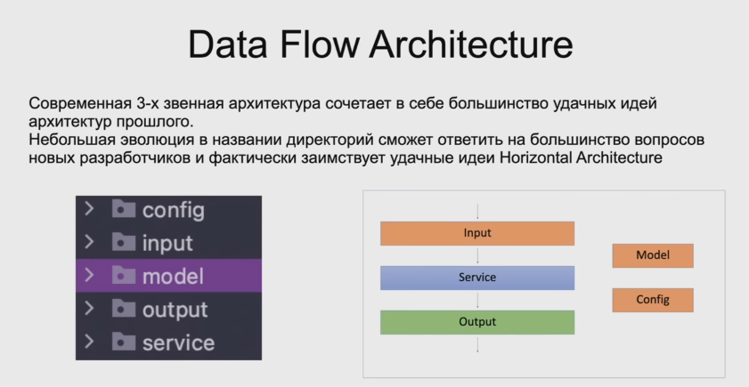

[Back](../README.md)

# Web Architecture (1st iteration).

For Java application. Rename package `repository` to `input` and `controller` to `output`.

## Load balancer
- [x] We will not consider this at the initial stage of the project.

## Web servers

### [Apache HTTP Server](https://httpd.apache.org/)

### [Nginx Web Server](https://www.nginx.com/)

### [Lighttpd Web Server](https://www.lighttpd.net/)

## Application servers

### [Apache Tomcat](http://tomcat.apache.org/)

Benefits of Apache Tomcat:

* Provides a flexible environment with built-in customization tools
* Uses lightweight code allowing faster deployment and loading of applications
* It’s a comparatively more stable platform than other Java EE application servers.

### [Jetty](https://www.baeldung.com/jetty-embedded#:~:text=%20Embedded%20Jetty%20Server%20in%20Java%20%201,has%20good%20support%20for%20asynchronous%20request...%20More%20)

Benefits of Jetty:

* Provides flexibility because you can use it as a web tier for full and partial Java application server stacks.
* Handles up to 10,000 requests, so it’s extremely fast and flexible.
* Small servlet memory design means that it’s highly scalable. 

### [Apache TomEE](http://tomee.apache.org/download-ng.html)

### [Oracle WebLogic](https://www.oracle.com/middleware/technologies/fusionmiddleware-downloads.html)

### [WebSphere](https://www.ibm.com/cloud/websphere-application-server?lnk=STW_US_STESCH&lnk2=trial_WASCloud&pexp=def&psrc=none&mhsrc=ibmsearch_a&mhq=webshpere)

### [JBoss Enterprise Application Platform](https://www.redhat.com/en/technologies/jboss-middleware/application-platform)

Benefits of JBoss Enterprise:

* Easier to access open-source tools thanks to the support from Red Hat.
* Complies with Java EE 7 specifications.
* There are web services, stacks, and cloud architectures.
* Automation features make it easy to manage.

### [WildFly](http://wildfly.org/)

### [Apache Geronimo](http://geronimo.apache.org/)

Benefits of Geronimo:

* It’s fully certified for a Java JEE 5 application server.
* Uses the best open source components.
* Provides support to Apache Derby DB and LDAP through built-in integrations.

### [Glassfish](https://www.oracle.com/middleware/technologies/glassfish-server.html)

Benefits of Glassfish:

* Provides optimum support for Enterprise JavaBeans, Java Server Faces, JMS, JPA, and many others.
* Easy to deploy Java codes because of its lightweight design
* You can create portable and scalable enterprise software, and integrate it with legacy systems.

## Database

### [PostgreSQL](https://www.postgresql.org/)
- [x] Select this database server.

## Cache servers
- [x] We will not consider this at the initial stage of the project.

## Cloud files storage
- [x] We will not consider this at the initial stage of the project.

## Job Queue
- [x] We will not consider this at the initial stage of the project.

## Application servers for Job Queue
- [x] We will not consider this at the initial stage of the project.

## Stream processing
- [x] We will not consider this at the initial stage of the project.

## Big Data Warehouse
- [x] We will not consider this at the initial stage of the project.

[Back](../README.md)
